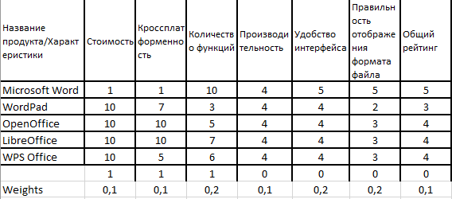

# Методы выбора лучшей альтернативы  

## Оглавнение

1. [Теория](#Теория)  
2. [Входные данные](#Входные-данные)
3. [Как пользоваться скриптом](#Как-пользоваться-скриптом)

## Теория
### Метод TOPSIS(Technique   for   Order   Preference   by Similarity   to   Ideal   Solution)

Основная идея данного метода очень проста: после определения «идеального» и «идеально-негативного» ожидаемого состояния 
производится попытка поиска такого решения, которое бы позволяло максимально приблизиться к «идеальному» состоянию 
и оставаться максимально удалённым от «идеально-негативного». Процесс принятия решения начинается с раунда оценивания,
когда эксперт оценивает все альтернативные решения по всем критериям. В результате формируется матрица решений.
Метод состоит из 6 последовательных шагов:  
1. расчёт нормализованной матрицы решения
2. расчёт взвешенной нормализованной матрицы решения
3. определение «идеального» и «идеально-негативного» ожидаемого состояния
4. расчёт метрики разделения
5. расчёт относительной близости к «идеальному» состоянию
6. ранжирование критериев
---
### Метод  анализа  соотношений MOORA  

Метод  MOORA  использует  систему  соотношений,  в  которой  каждое  отношение альтернативы к цели сравнивается со 
знаменателем, который является суммой всех отношений альтернатив к данной цели. Для этого знаменателялучшим решением 
будет квадратный корень изсуммы квадратов отношенийкаждой альтернативы к цели:


---
### Метод ELECTRE(ELimination and Choice Expressing REality)

В целом, данные подход предоставляет возможность оценить степень превосходства одного альтернативного решения над 
другими спомощью анализа их согласования. Процесс принятия решения начинается с раунда оценивания, когда эксперт 
оценивает все альтернативные решения по всем критериям. Врезультате формируется матрица решений. Метод состоит из 9 
последовательных шагов:
1. расчёт нормализованной матрицы решения
2. расчёт взвешенной нормализованной матрицы решения
3. построение множеств согласия и несогласия
4. расчёт матрицы согласия
5. расчёт матрицы несогласия
6. построение матрицы индексов согласия превосходства
7. построение матрицы индексов несогласия превосходства
8. построение агрегированной матрицы превосходства
9. удаление наименее предпочтительных альтернатив
***
## Входные данные
Ввод осуществляется в виде exel файла с расширением xls
### Пример
  
Где последняя строка это веса критериев, а предпоследняя их значимость
***
## Как пользоваться скриптом
Скрипт запускается через консоль в виде:  
*xls_file - имя файла с входными данными  
(В репозитории test.xls)
1. Topsis
    ```cmd
    py main.py *xls_file -t 
    ```
    или
    ```cmd
    py main.py *xls_file --Topsis 
    ```
2. MOORA
    ```cmd
    py main.py *xls_file -m
    ```
    или
    ```cmd
    py main.py *xls_file --Moora 
    ```
3. Electre
    ```cmd
    py main.py *xls_file -e
    ```
    или
    ```cmd
    py main.py *xls_file --Electre 
    ```
